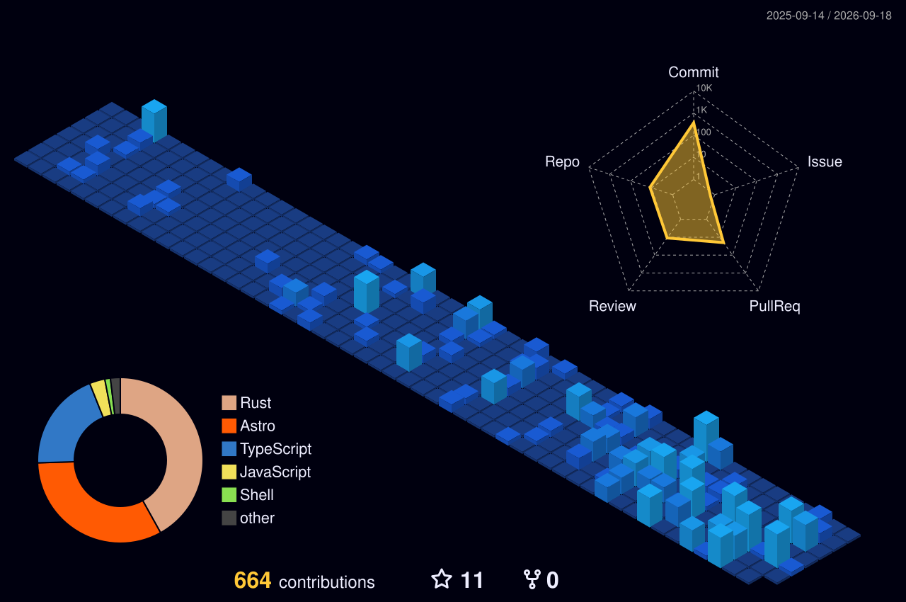

  

  
  &nbsp;
  
  &nbsp;
  

 

  

 

---

### 👨‍💻 About Me

Hey there! I'm **Genaro Febbo Yapur**, a Full-Stack developer from Buenos Aires, Argentina 🇦🇷. I specialize in crafting high-performance, accessible, and elegant digital products powered by modern architectures.

- 🚀 **Ecosystem:** Deeply immersed in **TypeScript**, **JavaScript**, and modern UI frameworks.
- 🛠️ **Core Stack:** **Astro**, **React**, **Next.js**, **Express**, **Node.js**, and **Tailwind CSS**.
- 🦀 **Exploring:** System programming with **Rust** and cloud automation.
- 💡 **Philosophy:** Building with clean architecture, continuous integration, and first-class developer experience.

 

---

### 🛠️ Tech Stack & Tooling

  

 

---

### 📊 Open Source & PR Contributions

  

 

---

### 📈 GitHub Metrics & Languages

  
  

 

  

 

---

### 🧊 3D Contribution Graph & Activity

  <picture>
    <source media="(prefers-color-scheme: dark)" srcset="./profile-3d-contrib/profile-night-view.svg">
    <source media="(prefers-color-scheme: light)" srcset="./profile-3d-contrib/profile-green.svg">
    
  </picture>

 

  <picture>
    <source media="(prefers-color-scheme: dark)" srcset="https://raw.githubusercontent.com/gefydev/gefydev/output/github-contribution-grid-snake-dark.svg">
    <source media="(prefers-color-scheme: light)" srcset="https://raw.githubusercontent.com/gefydev/gefydev/output/github-contribution-grid-snake.svg">
    
  </picture>

 

---

  

 

  

